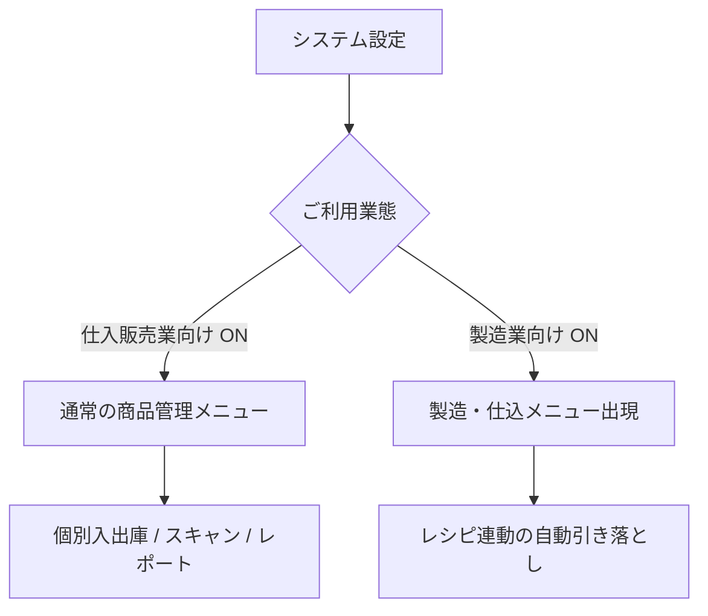
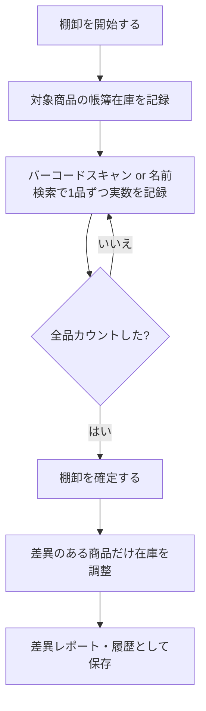

# Lucke Inventory 全体仕様書 & 取扱マニュアル

Lucke Inventory は、仕入販売業や飲食・製造業における複雑な在庫管理をシンプルかつスマートに行うための在庫管理システムです。  
このドキュメントでは、設定による機能の変化や、具体的な業務の流れに沿った使い方について解説します。

---

## 1. アプリの構成と設定（ご利用業態について）

「システム設定」画面の **「ご利用業態」** のチェックボックスの切り替えにより、アプリ内の機能が自動的に最適化されます。業態に合わせてどちらか一方、あるいは両方をONにしてご利用いただけます。



### ① 仕入販売業向け機能（通常の在庫管理）
小売業、卸売業、消耗品管理などに適したモードです。
- **できること**: 商品を個別に登録し、仕入れた際（入庫）や販売・使用した際（出庫）に手動、またはバーコードスキャンで在庫数を増減させます。
- **表示される機能**: 在庫一覧、新規商品登録、個別商品の入出庫画面、スキャン画面（バーコード検品）。

### ② 製造業向け機能 (BOM・レシピ連動)
飲食店（仕込み・調理）や加工製造業、BOM（部品表）管理に適したモードです。
- **できること**: レシピ作成アプリ「FoodLabel Pro」と連動し、**「完成品を1つ製造すると、必要な原材料の在庫が自動で減算され、完成品の在庫が自動で加算される」** という自動化処理を行います。
- **表示される機能**: ナビゲーションメニューに **「製造・仕込」** ページが追加されます。

---

## 2. コア機能の使い方

### A. 商品の管理と一覧切り替え
在庫一覧画面では、用途に合わせて表示形式を瞬時に切り替えられます。

| 表示モード | 特徴 | おすすめの用途 |
| :--- | :--- | :--- |
| **グリッド表示（画像あり）** | 商品写真を大きく表示。直感的に商品を見分けることができます。 | 備品やパッケージ製品の管理 |
| **リスト表示（画像なし）** | 1枚の表形式で表示。1件あたりの表示面積が従来の1/4になり、一覧性が非常に高い。 | 登録数が多い場合、スマホで一括スクロールしたい場合 |

> [!TIP]
> 表示モードはブラウザに自動保存されます。一度「リスト表示」にすれば、次回以降も自動的にリスト表示の状態で起動します。

---

### B. 製造・仕込（レシピ連動）の実行手順
「製造業向け機能」がONのときに使用可能です。

1. **レシピの選択**: 
   「製造・仕込」画面を開くと、左側に FoodLabel Pro で作成済みのレシピ一覧が読み込まれます。製造したいレシピを選択します。
2. **製造数の入力**: 
   製造したい数量を入力します。
3. **必要材料の自動計算と在庫チェック**: 
   入力した製造数に応じて、必要な原材料の量が自動計算され、現在の在庫が足りているか（不足していないか）がリアルタイムに色付き（グリーン/レッド）で判定されます。
4. **製造の確定**: 
   「この内容で製造を記録する」ボタンを押すと、以下の処理がバックグラウンドで瞬時に実行されます。
   - **完成品**の在庫数が製造数分 **プラス（入庫）** される。
   - **構成材料（原材料）**の在庫数が自動計算された分だけ **マイナス（出庫）** される。
   - それぞれのアイテムに「製造（レシピ連動）」および「製造使用（〇〇）」というメモ付きの入出庫履歴が自動で書き込まれます。

---

### C. スマートスキャン機能
カメラを利用して、現場での作業をスマートに行うための機能です。

- **バーコードスキャン（入出庫）**: 
  商品のバーコードをスキャンすると該当商品が瞬時に呼び出され、「+1入庫」「-1出庫」をワンタップで行えます。
- **棚卸調整（簡易・1品ずつ）**: 
  帳簿上の理論値と、実際に数えた「実在庫数」にズレがある場合、スキャンして実数を入力するだけで、ズレの分（差分）の入出庫履歴を自動で作成して在庫を補正します。1品だけサッと数え直したいときに便利です（スタンダードプラン以上）。複数商品をまとめて棚卸したい場合は、4章の「本格棚卸セッション」機能をご利用ください。
- **納品書AI解析（OCR）**: 
  紙の納品書をカメラで撮影するだけで、仕入先、商品名、数量、単価をAIが解析し、一括で入庫登録を行うことができます。（プロフェッショナルプラン限定）

---

### D. 出庫承認ワークフロー
（※プロフェッショナルプラン限定機能）

一般スタッフが商品の「出庫」を行う際、勝手に在庫を減らすのではなく、管理者の「承認」を挟むプロセスを組むことができます。

```
[一般スタッフ] 出庫申請を送信 (ステータス: 承認待ち)
      ↓
[管理者] 承認待ち一覧画面で内容確認 (承認 / 却下)
      ↓ (承認された場合)
実際の在庫数が減算され、取引確定
```

---

## 3. その他の便利な連携機能

### HACCPアプリ（外部）との検品連動
Luckeが提供する外部の「HACCP温度・衛生管理アプリ（ `https://haccp.lucke.jp/` ）」と、商品名をキーにした連携機能があります。

- **設定方法**:  
  システム設定（`/settings`）の「HACCP連携項目を表示」をONにすると表示される「HACCP連携用ユーザーID」をコピーし、HACCPアプリ側の管理設定画面（「在庫アプリ(Lucke Inventory)連携」欄）に貼り付けて保存します。
- **動作（書き込み）**:  
  HACCPアプリ側で食材の「納品検品記録」を行うと、こちら側の在庫のうち**品名が一致する商品**の在庫数に自動で数量が加算され、入庫履歴（取引記録）も自動的に記録されます。検品時にHACCP側へ記録を付けるだけで在庫登録が完了するため、Lucke側で二重に入力する手間がなくなります。
- **動作（表示）**:  
  HACCPアプリの「在庫・納品記録」ページには、こちらの在庫が「連携中の在庫」として表示されます（閲覧のみ、編集はこちら側の画面で行います）。HACCP側に同名の独自在庫がある場合は、二重表示を避けるためHACCP独自の一覧からは自動的に非表示になります。
- **商品名の一致条件（重要）**:  
  一致判定は「前後の空白を除去し、半角英字の大文字・小文字を区別しない」比較のみです。全角・半角の違いや表記ゆれ（例:「小麦粉」と「強力粉」）は別商品として扱われ、一致しません。連携を正しく機能させるには、**両アプリで商品名をできるだけ同じ表記に統一**してご登録ください。
- **二重カウントの防止**:  
  HACCP側は、品名の一致で在庫アプリ側への加算に成功した場合はHACCP独自在庫を加算しません（成功しなかった場合のみ、従来どおりHACCP独自在庫に加算されます）。そのため、同じ納品が両方のシステムで二重にカウントされることはありません。なお、HACCP側の納品記録（履歴）自体は連携の成否にかかわらず必ず保存されます。
- **単位のチェックについて**:  
  品名が一致しても、こちら側に登録している単位（例:「ml」）と、HACCP側で入力された単位（例:「本」）が食い違っている場合は加算されません。単位が異なる数量をそのまま加算すると実態と合わない値になってしまうためです。この場合、HACCP側には「単位が一致しないため反映しませんでした」という案内とこちら側の登録単位が表示され、HACCP側の独自在庫にはフォールバックとして通常どおり加算されます。単位の自動換算（例: 1本=200mlとして計算する等）には対応していないため、両アプリで単位を揃えて登録することを推奨します。なお、HACCP側の納品記録フォームには、品目名を入力すると連携中の単位を自動入力する機能があり、通常の運用ではこの不一致は起きにくくなっています。
- **「HACCP連携する商品カテゴリ」の絞り込みについて**:  
  設定画面のこの項目で絞り込みを設定すると、HACCP側の「連携中の在庫」表示（読み取り）にはその絞り込みが反映されますが、納品記録による在庫加算（書き込み）は絞り込みに関係なく全商品が対象になります。表示の絞り込みと書き込みの対象は連動していない点にご注意ください。
- **HACCP側での絞り込み表示について**:  
  こちら側の商品数が増えてきた場合、各商品にカテゴリを設定しておくと、HACCP側の「在庫・納品記録」ページに表示される「連携中の在庫」一覧で、HACCP側の画面からカテゴリ別に絞り込んで確認できます。
- **ユーザーIDについて**:  
  ログイン方法（Googleログイン／メールアドレス+パスワード）を変更すると、Firebase認証の仕組み上、別アカウント扱いとなりユーザーIDが変わります。連携を維持するには、登録時と同じログイン方法を使い続けてください。
- **詳細・Q&A**:  
  より詳しいQ&Aは、アプリ内の「よくある質問」ページ（`/faq`、ナビゲーションまたはフッターからアクセス可能）にまとめています。

---

## 4. バーコード発行・本格棚卸セッション機能（2026-09追加）

### A. バーコードの自動発行・ラベル印刷

量り売りの食材や手作り品など、メーカーのバーコードが無い商品でも、このアプリ側でバーコードを発行して運用できます。

- **発行できる場所**: 「新規商品登録」画面・「商品情報の編集」画面・商品詳細ページ・「ラベル発行・印刷」ページ（`/inventory/labels`）のいずれからも、その場でバーコードを自動発行できます。
- **発行される番号について**: JAN/EANコードの規格に沿った13桁の番号を発行します。先頭2桁（20〜29）は「社内・店舗内利用」向けに予約されている範囲を使用しているため、実在するメーカー商品のバーコードと衝突することはなく、市販の一般的なバーコードスキャナやスマートフォンのカメラでも問題なく読み取れます。
- **ラベル印刷**: 「ラベル発行・印刷」ページでは、バーコード未登録の商品が一覧表示され、複数商品をまとめて選択して発行・印刷できます。A4用紙に複数枚のラベルを並べて印刷するレイアウトになっており、印刷後はカットして商品に貼り付けてご利用ください。
- **運用の流れの例**: 仕入れた商品にバーコードが無い → 「ラベル発行・印刷」ページ（または在庫一覧に表示されるバナー）から発行 → 印刷して商品に貼付 → 以降は他の商品と同じようにスキャンで入出庫・棚卸ができるようになります。

> [!TIP]
> 在庫一覧画面には、バーコード未登録の商品が1件でもあると案内バナーが表示され、そこから「ラベル発行・印刷」ページへワンタップで移動できます。

### B. 本格棚卸セッション機能（プロプラン限定）

複数人・複数商品でまとめて棚卸を行うための機能です。ナビゲーションの「本格棚卸」、または在庫一覧画面の「棚卸」ボタンから利用できます（`/inventory/stocktake`）。



1. **棚卸の開始**: 「棚卸を開始する」を押すと、その時点の対象商品すべての帳簿在庫（理論値）を記録した「棚卸セッション」が作成されます。拠点を設定している場合は、特定の拠点だけを対象にすることもできます。
2. **カウント作業**: バーコードをスキャンするか、バーコードの無い商品は名前で検索して選び、実際に数えた数を入力して記録していきます。未カウント・カウント済みのタブで進捗を確認できます。複数のスタッフが別々の端末・スマートフォンで同時に同じ棚卸セッションにアクセスして分担してカウントすることもできます（記録内容はリアルタイムに共有されます）。
3. **セッション中に見つかった未登録商品**: スキャンしたバーコードがこの棚卸の対象に含まれていない場合、その場でセッションに追加してカウントするか、新規商品として登録できます。
4. **棚卸の確定**: 「棚卸を確定する」を押すと、理論値と実測値にズレがあった商品だけ、その差分がまとめて入出庫履歴として記録され、在庫数が調整されます。未カウントのまま残っている商品は在庫を変更せずそのままにできます。
5. **差異レポート・履歴**: 確定後は、カウント件数・差異件数・差異金額（棚卸ロス/棚卸差益）のサマリーと、商品ごとの理論値・実測値・差異の一覧を確認できます。CSVエクスポートにも対応しています。過去の棚卸はすべて履歴として保存され、いつでも見返せます。

> [!NOTE]
> 本格棚卸セッション機能はプロプラン限定です。1品だけサッと数え直したい場合は、引き続きスタンダードプラン以上でスキャン画面の簡易「棚卸」モードがご利用いただけます。

---

## 5. 税務・確定申告用レポート

「在庫レポート（確定申告用）」画面では、保管している全商品の価値（資産価値）を自動計算し、CSVに出力できます。

- **先入先出法 (FIFO)**: 先に仕入れた古いものから順に出庫されたと仮定して、期末に残った在庫の価値を計算します。
- **移動平均法**: 仕入れる度にその時点での平均単価を算出し直して在庫価値を計算します。

> [!NOTE]
> 評価方法はシステム設定（`/settings`）からいつでも切り替え可能です。確定申告の棚卸資産計上にそのままご使用いただけます。
